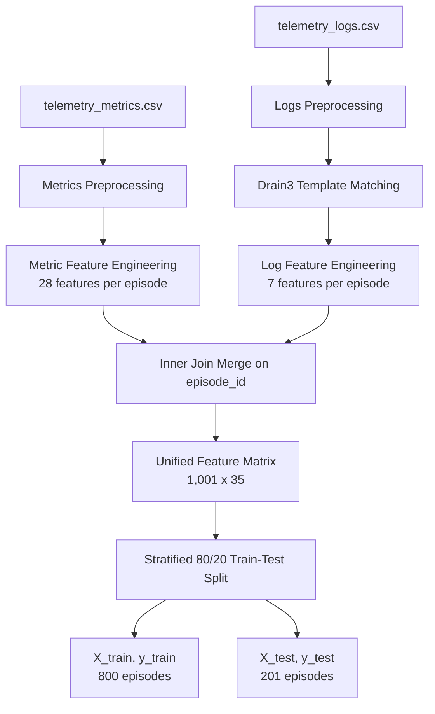

# AIOps Telemetry Platform & ML Pipeline

A unified telemetry collection, processing, and machine learning pipeline for automated IT systems failure diagnosis. The platform uses **Drain3 Log Template Mining** and statistical metric feature extraction to train classifiers targeting **13 distinct system failure modes**.

---

## Project Structure

```text
DEVOPS/
├── data/
│   ├── telemetry_metrics.csv       # Raw telemetry metrics (120,120 rows)
│   ├── telemetry_logs.csv          # Raw telemetry logs (120,120 rows)
│   ├── telemetry_traces.csv        # Raw telemetry trace entries
│   ├── X_train.csv                 # Processed training features (800 x 35)
│   ├── X_test.csv                  # Processed testing features (201 x 35)
│   ├── y_train.csv                 # Stratified train labels
│   ├── y_test.csv                  # Stratified test labels
│   ├── feature_names.json          # List of 35 engineered feature names
│   ├── confusion_matrix_*.png      # Confusion matrices for RF, XGB, LGBM
│   └── feature_importance_*.png    # Top 20 feature importances for models
├── offline/
│   └── train_log_templates.py      # Phase 1: Offline Drain3 training script
├── implementation_plan/
│   └── implementation_plan.md      # Approved technical architecture plan
├── data_pipeline.py                # Phase 2: Combined metrics & logs pipeline + ML driver
├── log_feature_engineering.py      # Independent log features extractor (spec-compliant)
├── generate_full_dataset.py        # Synthesizes raw metric, log, & trace CSVs
├── drain3.ini                      # Drain3 parser configuration
├── drain_state.bin                 # Frozen Drain3 miner state snapshot
└── known_log_templates.json        # Discovered log template IDs
```

---

## 🛠️ Data Preparation Pipeline

The preprocessing workflow handles raw telemetry datasets (1,001 unique episodes in total) through the following pipeline:



### 1. Metric Features (28)
Extracted statistics (mean, max, std, trend slope, circuit breaker open ratio) over time windows within each episode:
* **CPU / Memory**: `cpu_mean`, `cpu_max`, `cpu_std`, `cpu_slope`, `memory_mean`, `memory_max`, `memory_growth_rate`, `heap_mean`, `heap_max`
* **Latency & RPS**: `p50_mean`, `p95_mean`, `p99_mean`, `latency_std`, `latency_slope`, `throughput_mean`, `throughput_std`
* **Cache / DB**: `cache_hit_ratio`, `cache_miss_ratio`, `db_latency_mean`, `db_connections_max`
* **GC & Disk**: `gc_pause_mean`, `gc_pause_max`, `disk_read_mean`, `disk_write_mean`
* **Errors & Circuit Breaker**: `network_errors_mean`, `error_rate_mean`, `error_rate_max`, `cb_open_ratio`

### 2. Log Features (7)
Structured features representing logging profiles and parsing details:
* `log_count`, `log_max_severity`, `log_critical_count`, `log_has_exception`, `log_has_novel_template`, `log_exception_type_encoded`, `log_severity_ratio`

---

## 🏆 Machine Learning Results

We trained three state-of-the-art classifier models on the preprocessed 35-feature matrix to diagnose **13 failure modes** (including `MEMORY_LEAK`, `CPU_SATURATION`, `BAD_DEPLOY`, `ERROR_STORM`, etc.).

### Accuracy Summary

| Classifier Model | Training Accuracy | Test Accuracy |
|------------------|-------------------|---------------|
| **Random Forest**| 100.00%           | **100.00%**   |
| **LightGBM**     | 100.00%           | **100.00%**   |
| **XGBoost**      | 100.00%           | **99.50%**    |

Confusion matrices and feature importance charts are stored under `data/`.

---

## 🚀 Running the Pipeline

### Prerequisites
Install all pipeline dependencies:
```bash
pip install drain3 scikit-learn pandas xgboost lightgbm matplotlib
```

### Step 1: Re-train Drain3 Log Parser (Offline)
Trains the Drain3 parser on the training logs corpus to establish a baseline of known templates:
```bash
python offline/train_log_templates.py
```
Outputs: `known_log_templates.json` and `drain_state.bin`.

### Step 2: Run End-to-End Pipeline & Train ML Models
Performs combined feature extraction, matrix preparation, split, and ML model training:
```bash
python data_pipeline.py
```
This produces final datasets in `data/` and saves diagnostic evaluation plots.
